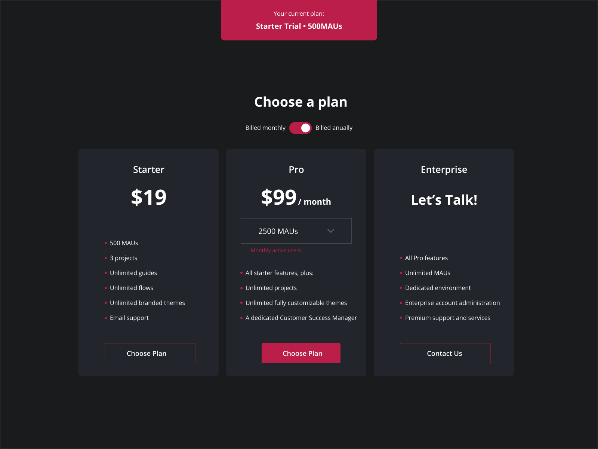

**Challenge Title**
Blog Card Component

**Challenge Description**
In this challenge, you'll build a Blog Card Component. This challenge is perfect for you if you've been learning CSS and want to take your CSS skills to the next level by building something new and beginner-friendly.

**Difficulty Level**
Beginner

**Tags**
FRONTEND

**Learning**
You'll learn how to use CSS Grid, how to make components fit into grids, and more. Did we mention it's also super fun?

**Requirements**

- Make it Responsive

I hope you'll enjoy building this challenge.

Feel free to share your solution on the website or on social media and tag [us](https://twitter.com/codingspace30).
